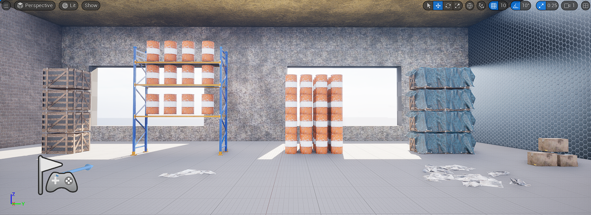
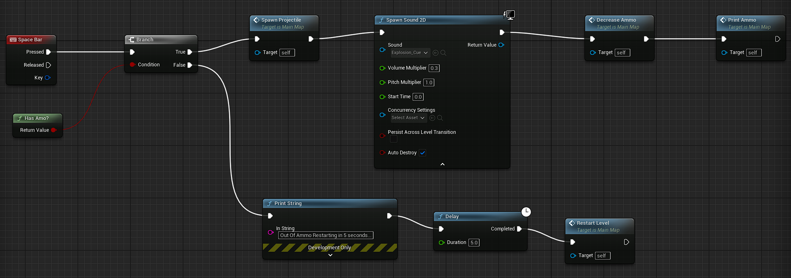
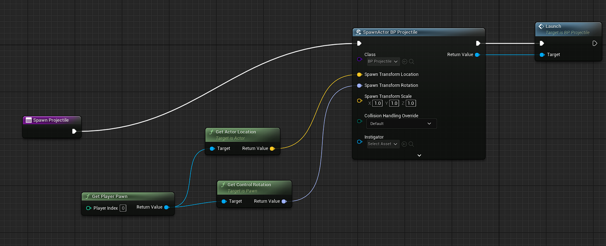
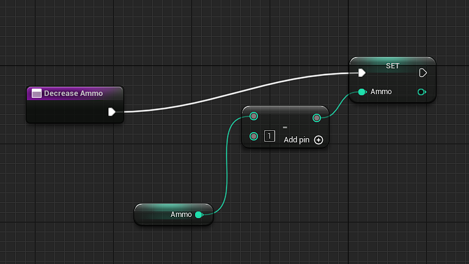
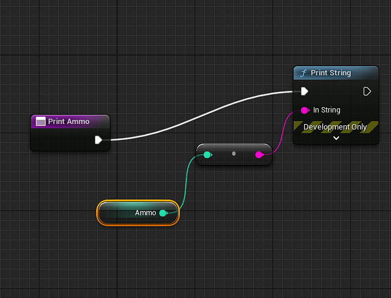
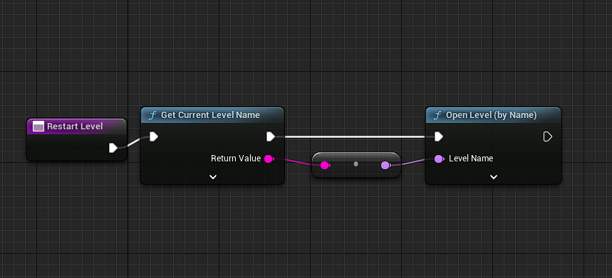
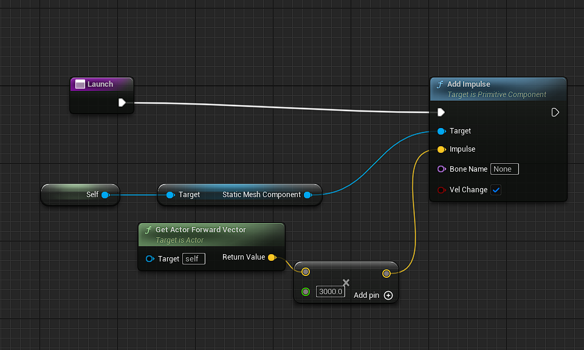

 

  <h3 align="center">Wrecking Crew
</h3>

  

    My First Unreal Engine 5 Game Project!
     
     
  

## Built With

Unreal Engine 5.3 
Blueprint Programming 
Industry Props Pack6 

## Getting Started

Space bar to shoot and watch the physics do their thing!
You have 20 ammo The game will let you know when you are out and then reset the level

I have a lot of experience with Unity so this project was very fun!

## What I Learned

Blueprint Programing! 
  -Nodes, IO Pins, Flows, and Connections! 
  -It's very intuitive node-based programming I'm a big fan! 
Unreal Basics: Maps, Actors, Children Parents (with the Rack Prop), Components, Transforms, Vectors, Building new basic Colider meshes (for the Barrels) 
  -I already knew all of this from my time with Unity but it was fun to learn them in a new engine environment 
BrushComponents 
-I had never used anything like brush components before in Unity so this was a nice surprise feature! 
I used subtractive brush components to hollow out the room and create easily moveable window holes it's a very useful tool sort of like a loony toons hole :)

## Game
 

## Level Code
 
Making functions out of blocks of nodes makes code a lot more readable while also not removing the ability to drill down and get deeper into the nuances of the programming.

## Spawn Projectile
 
The Spawning projectile code was maybe the hardest part aligning the projectile with the player pawn's position and view angle 

## Decreace Ammo
 
Once I had an ammo variable decreasing it in the blueprint was pretty easy and instead of messing with Ui elements just yet I opted to have a simple scope for this project and simply print it on the screen once out of ammo an additional space bar press calls Restart level function.

## Print Ammo Count
 
Print Ammo is pretty self-explanatory it prints your ammo count on the screen so you know how much you have.

## RestartLevel
 
Restart Level resets the level as a placeholder for a level transition.

## Launch
 
The Launch function added an impulse to fire the projectile off along with adjusting its mass and impulse power to give the projectile the power it needed to do some destruction!

